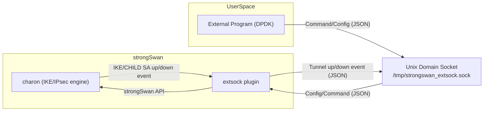
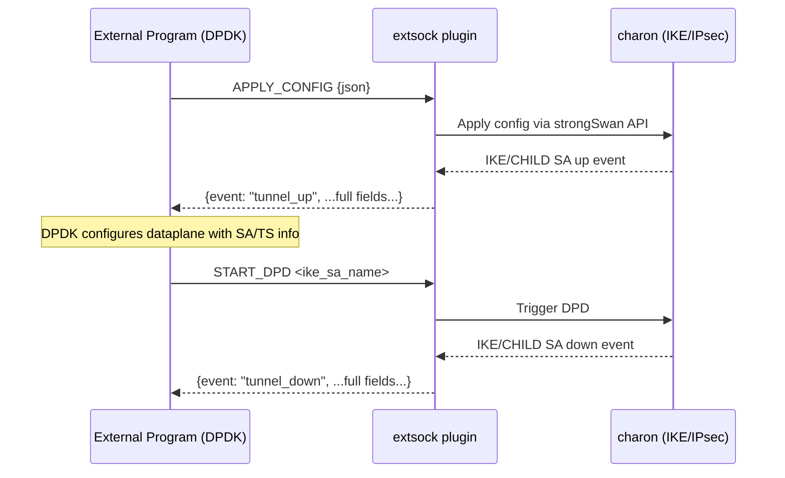
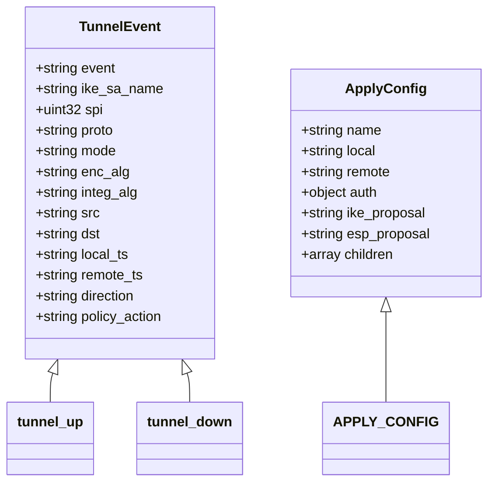
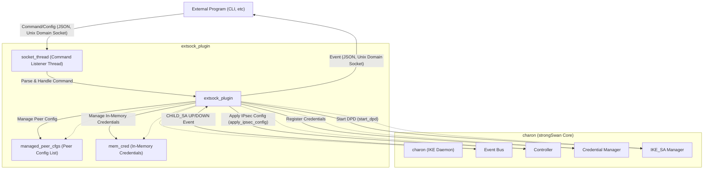

1. Flowchart

```mermaid
%%{init: {'themeVariables': { 'width': '1000' }}}%%
flowchart LR
    subgraph strongSwan
        direction TB
        A["charon (IKE/IPsec engine)"]
        B["extsock plugin"]
    end
    subgraph UserSpace
        C["External Program (DPDK)"]
    end
    D["Unix Domain Socket\n/tmp/strongswan_extsock.sock"]

    A -- "IKE/CHILD SA up/down event" --> B
    B -- "Tunnel up/down event (JSON)" --> D
    C -- "Command/Config (JSON)" --> D
    D -- "Config/Command (JSON)" --> B
    B -- "strongSwan API" --> A
```

2. SequenceDiagram

```mermaid
%%{init: {'themeVariables': { 'width': '1000' }}}%%
sequenceDiagram
    participant ExtProg as External Program (DPDK)
    participant extsock as extsock plugin
    participant charon as charon (IKE/IPsec)
    ExtProg->>extsock: APPLY_CONFIG {json}
    extsock->>charon: Apply config via strongSwan API
    charon-->>extsock: IKE/CHILD SA up event
    extsock-->>ExtProg: {event: "tunnel_up", ...full fields...}
    Note over ExtProg: DPDK configures dataplane with SA/TS info
    ExtProg->>extsock: START_DPD <ike_sa_name>
    extsock->>charon: Trigger DPD
    charon-->>extsock: IKE/CHILD SA down event
    extsock-->>ExtProg: {event: "tunnel_down", ...full fields...}
```

3. ClassDiagram

```mermaid
%%{init: {'themeVariables': { 'width': '1000' }}}%%
classDiagram
    class TunnelEvent {
        +string event
        +string ike_sa_name
        +uint32 spi
        +string proto
        +string mode
        +string enc_alg
        +string integ_alg
        +string src
        +string dst
        +string local_ts
        +string remote_ts
        +string direction
        +string policy_action
    }
    class ApplyConfig {
        +string name
        +string local
        +string remote
        +object auth
        +string ike_proposal
        +string esp_proposal
        +array children
    }
    TunnelEvent <|-- tunnel_up
    TunnelEvent <|-- tunnel_down
    ApplyConfig <|-- APPLY_CONFIG
```

4. Block diagram

```mermaid
flowchart TD
    %% External Program
    extprog["External Program (CLI, etc)"]

    %% extsock_plugin main components
    subgraph "extsock_plugin"
        socket_thread["socket_thread (Command Listener Thread)"]
        extsock["extsock_plugin"]
        managed_cfgs["managed_peer_cfgs (Peer Config List)"]
        mem_cred["mem_cred (In-Memory Credentials)"]
    end

    %% strongSwan Core
    subgraph "charon (strongSwan Core)"
        charon["charon (IKE Daemon)"]
        bus["Event Bus"]
        controller["Controller"]
        credmgr["Credential Manager"]
        ike_sa_mgr["IKE_SA Manager"]
    end

    %% Data/Command Flow
    extprog -- "Command/Config (JSON, Unix Domain Socket)" --> socket_thread
    socket_thread -- "Parse & Handle Command" --> extsock

    extsock -- "Apply IPsec Config (apply_ipsec_config)" --> controller
    extsock -- "Start DPD (start_dpd)" --> ike_sa_mgr
    extsock -- "Register Credentials" --> credmgr
    extsock -- "Manage Peer Config" --> managed_cfgs
    extsock -- "Manage In-Memory Credentials" --> mem_cred

    bus -- "CHILD_SA UP/DOWN Event" --> extsock
    extsock -- "Event (JSON, Unix Domain Socket)" --> extprog

    %% Dotted lines (internal references)
    extsock -.-> controller
    extsock -.-> credmgr
    extsock -.-> ike_sa_mgr
    extsock -.-> bus
    extsock -.-> managed_cfgs
    extsock -.-> mem_cred
```

