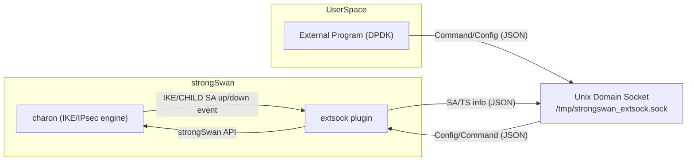
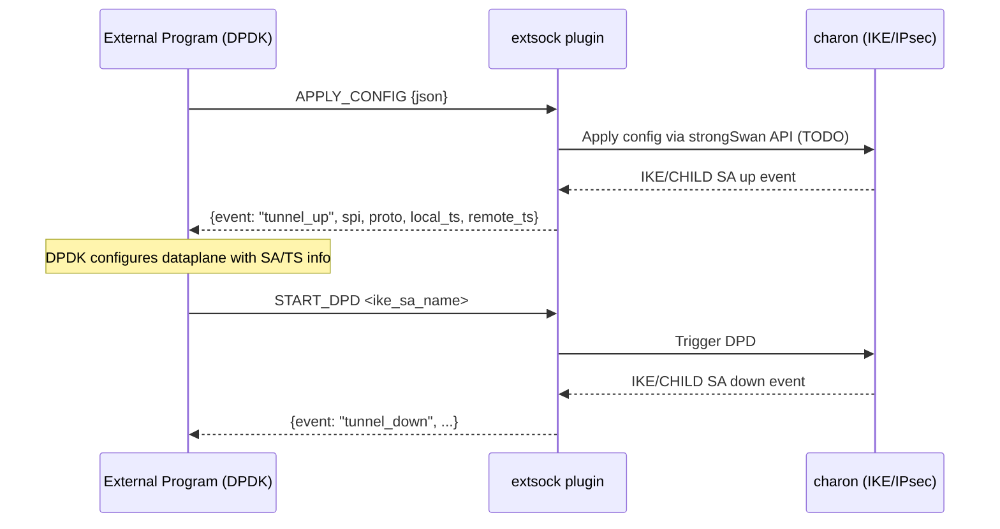
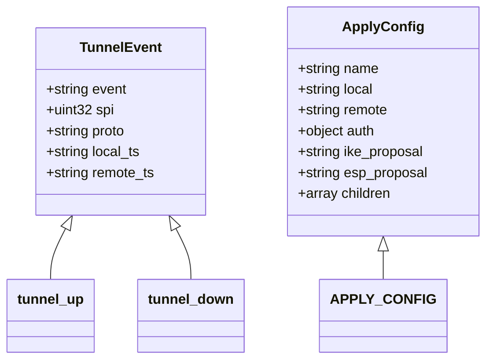

1. Flowchart

```mermaid
%%{init: {'themeVariables': { 'width': '1001' }}}%%
flowchart LR
    subgraph strongSwan
        direction TB
        A["charon (IKE/IPsec engine)"]
        B["extsock plugin"]
    end
    subgraph UserSpace
        C["External Program (DPDK)"]
    end
    D["Unix Domain Socket\n/tmp/strongswan_extsock.sock"]

    A -- "IKE/CHILD SA up/down event" --> B
    B -- "SA/TS info (JSON)" --> D
    C -- "Command/Config (JSON)" --> D
    D -- "Config/Command (JSON)" --> B
    B -- "strongSwan API" --> A
```

2. SequenceDiagram

```mermaid
%%{init: {'themeVariables': { 'width': '1000' }}}%%
sequenceDiagram
    participant ExtProg as External Program (DPDK)
    participant extsock as extsock plugin
    participant charon as charon (IKE/IPsec)
    ExtProg->>extsock: APPLY_CONFIG {json}
    extsock->>charon: Apply config via strongSwan API (TODO)
    charon-->>extsock: IKE/CHILD SA up event
    extsock-->>ExtProg: {event: "tunnel_up", spi, proto, local_ts, remote_ts}
    Note over ExtProg: DPDK configures dataplane with SA/TS info
    ExtProg->>extsock: START_DPD <ike_sa_name>
    extsock->>charon: Trigger DPD
    charon-->>extsock: IKE/CHILD SA down event
    extsock-->>ExtProg: {event: "tunnel_down", ...}
```

3. ClassDiagram

```mermaid
%%{init: {'themeVariables': { 'width': '1000' }}}%%
classDiagram
    class TunnelEvent {
        +string event
        +uint32 spi
        +string proto
        +string local_ts
        +string remote_ts
    }
    class ApplyConfig {
        +string name
        +string local
        +string remote
        +object auth
        +string ike_proposal
        +string esp_proposal
        +array children
    }
    TunnelEvent <|-- tunnel_up
    TunnelEvent <|-- tunnel_down
    ApplyConfig <|-- APPLY_CONFIG
```