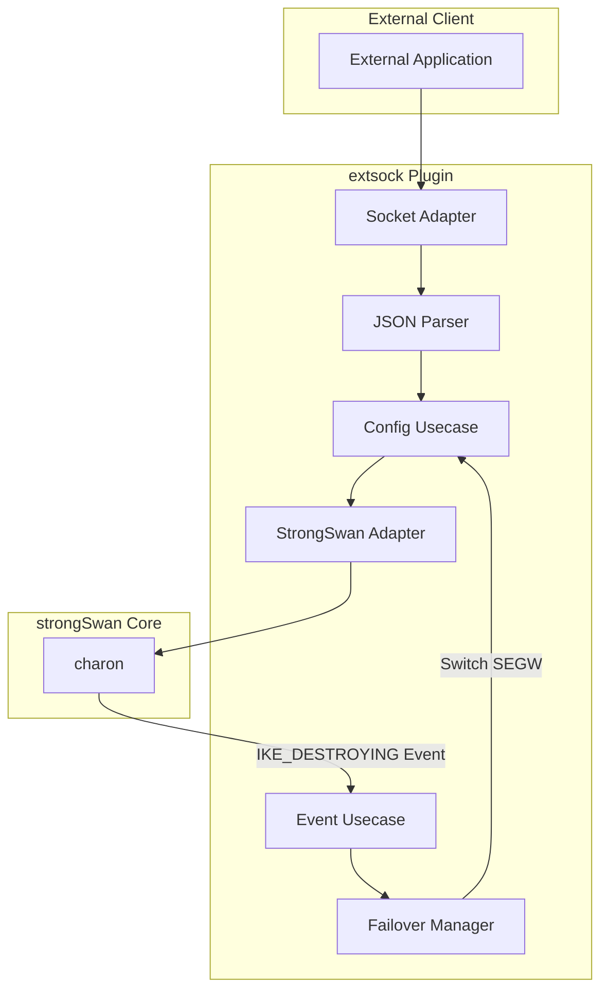
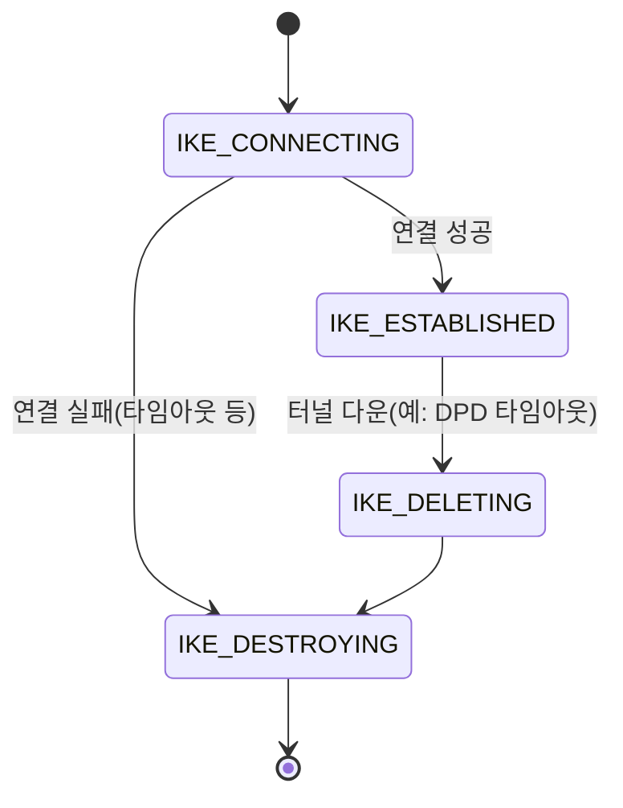

# extsock 플러그인 2nd SEGW 지원 상세 설계서

## 1. 개요

### 1.1 목표
- extsock 플러그인에서 2nd SEGW 지원 기능 구현
- 쉼표(,) 구분된 remote address 설정 지원
- `IKE_DESTROYING` 이벤트 기반 자동 failover 구현
- 단순한 즉시 전환 방식으로 초기 구현

### 1.2 핵심 설계 원칙
- **단일 시작점**: `IKE_DESTROYING` 이벤트만으로 모든 failover 케이스 처리
- **즉시 전환**: 복잡한 백오프 정책 없이 즉시 2nd SEGW로 전환
- **기존 아키텍처 유지**: Clean Architecture 패턴 준수

---

## 2. 아키텍처 설계

### 2.1 전체 시스템 구조



### 2.2 주요 컴포넌트 역할
- **Config Usecase**: remote address(1st, 2nd SEGW) 파싱 및 저장
- **Event Usecase**: IKE 상태 변화 감지, IKE_DESTROYING 이벤트 트리거
- **Failover Manager**: 현재 SEGW 상태 추적, 전환 로직 수행
- **StrongSwan Adapter**: charon과의 인터페이스

---

## 3. 상세 동작 흐름

### 3.1 설정 구조
- remote address는 쉼표(,)로 구분된 문자열로 입력
- 예시: `"remote_addrs": "10.0.0.1,10.0.0.2"`
- 파싱 후 1st, 2nd SEGW로 분리하여 관리

### 3.2 상태 전이 및 이벤트 흐름



- **IKE_DESTROYING** 상태 진입 시, Event Usecase에서 failover 트리거
- Failover Manager가 현재 SEGW 상태를 확인 후, 2nd SEGW로 전환
- Config Usecase가 2nd SEGW 주소로 새로운 연결 시도

### 3.3 주요 시나리오
- 1st SEGW 연결 실패 → IKE_DESTROYING → 2nd SEGW로 전환
- 터널 운영 중 다운(예: DPD 타임아웃) → IKE_DESTROYING → 2nd SEGW로 전환

---

## 4. 인터페이스 설계

### 4.1 Failover Manager
```c
// interfaces/extsock_failover_manager.h
typedef struct extsock_failover_manager_t {
    extsock_error_t (*switch_to_secondary)(extsock_failover_manager_t *this, const char *connection_name);
    extsock_error_t (*switch_to_primary)(extsock_failover_manager_t *this, const char *connection_name);
    void (*handle_connection_failure)(extsock_failover_manager_t *this, ike_sa_t *ike_sa);
} extsock_failover_manager_t;
```

### 4.2 Event Usecase
- IKE 상태 변화 감지
- IKE_DESTROYING 이벤트 발생 시 Failover Manager 호출

---

## 5. 정책 및 향후 확장
- 초기 구현은 즉시 전환, 단순 정책 적용
- 추후 재시도/백오프/상태 이력 관리 등 확장 가능

---

## 6. 참고
- strongSwan의 IKE SA 상태 전이: IKE_DESTROYING이 모든 연결 실패/종료 상황에서 발생
- extsock 기존 이벤트 핸들링 구조와의 연계 용이 