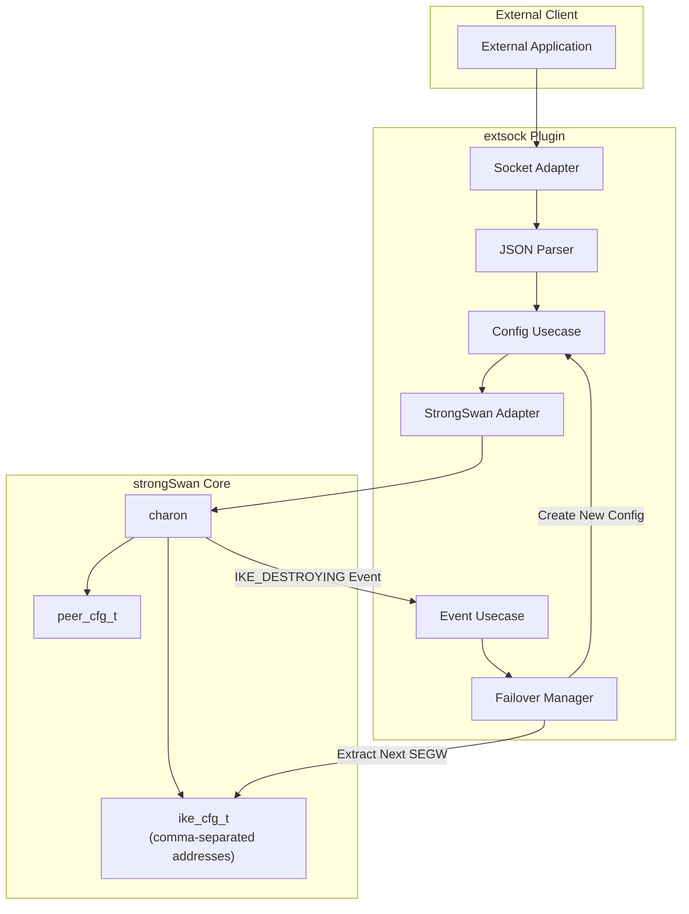
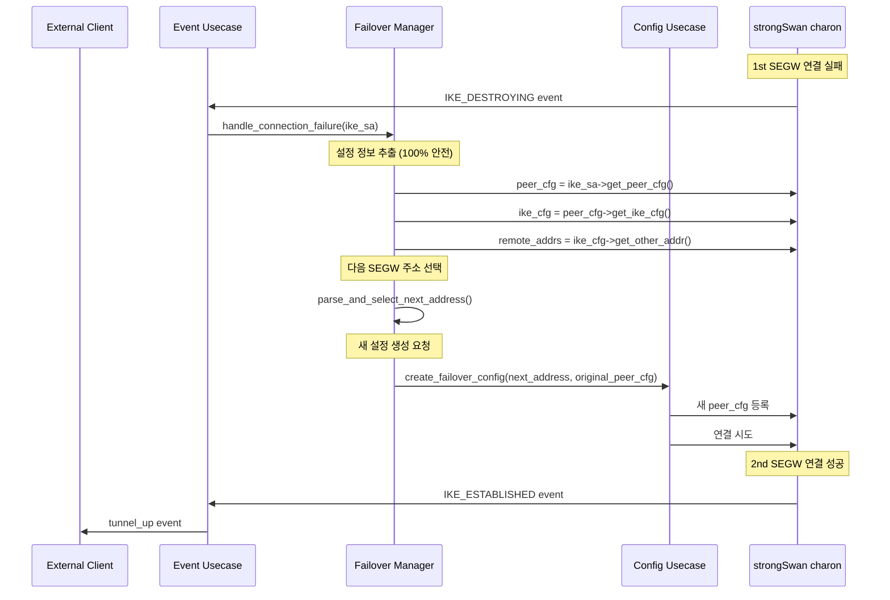
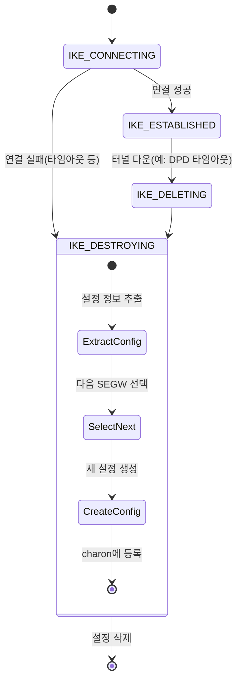

# extsock 플러그인 2nd SEGW 지원 상세 설계서

## 1. 개요

### 1.1 목표
- extsock 플러그인에서 2nd SEGW 지원 기능 구현
- 쉼표(,) 구분된 remote address 설정 지원
- `IKE_DESTROYING` 이벤트 기반 자동 failover 구현
- 단순한 즉시 전환 방식으로 초기 구현

### 1.2 핵심 설계 원칙
- **단일 시작점**: `IKE_DESTROYING` 이벤트만으로 모든 failover 케이스 처리
- **즉시 전환**: 복잡한 백오프 정책 없이 즉시 2nd SEGW로 전환
- **기존 아키텍처 유지**: Clean Architecture 패턴 준수
- **설정 관리 최적화**: charon의 기존 설정 관리 메커니즘 활용

---

## 2. strongSwan 설정 관리 분석

### 2.1 ike_cfg_t의 쉼표 구분 주소 지원

strongSwan의 `ike_cfg_t`는 이미 쉼표로 구분된 remote address를 완벽하게 지원합니다:

```c
// src/libcharon/config/ike_cfg.c:491-515
static void parse_addresses(char *str, linked_list_t *hosts, linked_list_t *ranges)
{
    enumerator_t *enumerator;
    
    enumerator = enumerator_create_token(str, ",", " ");  // 쉼표로 토큰화
    while (enumerator->enumerate(enumerator, &str))
    {
        hosts->insert_last(hosts, strdup(str));  // 개별 주소 저장
    }
    enumerator->destroy(enumerator);
}
```

**저장 구조:**
- `ike_cfg->other`: 원본 문자열 (예: "10.0.0.1,10.0.0.2")
- `ike_cfg->other_hosts`: linked_list에 파싱된 개별 주소들
- `resolve_other()`: 첫 번째 주소를 기본값으로 반환

### 2.2 설정 정보 접근 경로

```
IKE SA → peer_cfg_t → ike_cfg_t → remote address list
```

**접근 방법:**
```c
peer_cfg_t *peer_cfg = ike_sa->get_peer_cfg(ike_sa);
ike_cfg_t *ike_cfg = peer_cfg->get_ike_cfg(peer_cfg);
char *remote_addrs = ike_cfg->get_other_addr(ike_cfg);  // "10.0.0.1,10.0.0.2"
```

---

## 3. IKE_DESTROYING 이벤트 타이밍 분석

### 3.1 설정 삭제 순서 및 타이밍

**🔍 핵심 발견: 설정 접근이 완전히 안전함**

```c
// src/libcharon/sa/ike_sa.c:3053-3150 (destroy 메서드)
METHOD(ike_sa_t, destroy, void, private_ike_sa_t *this)
{
    // 1. Bus SA 설정
    charon->bus->set_sa(charon->bus, &this->public);
    
    // 2. 🎯 IKE_DESTROYING 상태 설정 및 리스너 호출
    set_state(this, IKE_DESTROYING);  
    // ↳ 내부에서 charon->bus->ike_state_change(..., IKE_DESTROYING) 즉시 호출
    
    // 3. Task manager 정리
    // 4. Attributes, CHILD SA, VIP 정리...
    
    // 5. ✅ peer_cfg가 여전히 사용됨 (라인 3097-3105)
    while (array_remove(this->other_vips, ARRAY_TAIL, &vip)) {
        if (this->peer_cfg) {  // peer_cfg 접근!
            linked_list_t *pools = linked_list_create_from_enumerator(
                this->peer_cfg->create_pool_enumerator(this->peer_cfg));
        }
    }
    
    // 6. Bus SA 해제
    charon->bus->set_sa(charon->bus, NULL);
    
    // 7. 🚨 여기서 비로소 설정 삭제 (라인 3140-3141)
    DESTROY_IF(this->ike_cfg);
    DESTROY_IF(this->peer_cfg);
}
```

### 3.2 set_state 함수의 동기 실행

```c
// src/libcharon/sa/ike_sa.c:996-997
static void set_state(private_ike_sa_t *this, ike_sa_state_t state)
{
    // ... 상태별 처리 ...
    
    charon->bus->ike_state_change(charon->bus, &this->public, state);  // 리스너 호출
    this->state = state;  // 상태 변경
}
```

**타이밍 보장:**
- **리스너들이 먼저 호출됨** → 그 다음에 상태 변경
- **동기적 실행**: 모든 리스너들이 완료될 때까지 다음 라인으로 진행하지 않음
- **원자적 실행**: 다른 작업이 끼어들 수 없음

### 3.3 Bus 리스너 호출 메커니즘

```c
// src/libcharon/bus/bus.c:487-512
METHOD(bus_t, ike_state_change, void, private_bus_t *this, ike_sa_t *ike_sa, ike_sa_state_t state)
{
    this->mutex->lock(this->mutex);
    enumerator = this->listeners->create_enumerator(this->listeners);
    while (enumerator->enumerate(enumerator, &entry)) {
        entry->calling++;
        keep = entry->listener->ike_state_change(entry->listener, ike_sa, state);  // 동기 호출
        entry->calling--;
    }
    enumerator->destroy(enumerator);
    this->mutex->unlock(this->mutex);
}
```

**보장 사항:**
- 모든 리스너들이 **순차적으로 동기 실행**
- 리스너 실행 중에는 IKE SA 상태가 변경되지 않음
- **설정 삭제는 모든 리스너 호출이 완료된 후**

---

## 4. 아키텍처 설계

### 4.1 전체 시스템 구조



### 4.2 주요 컴포넌트 역할
- **Config Usecase**: 새로운 peer_cfg 생성 (주소만 변경)
- **Event Usecase**: IKE 상태 변화 감지, IKE_DESTROYING 이벤트 트리거
- **Failover Manager**: 현재 SEGW 상태 추적, 다음 주소 선택, 전환 로직 수행
- **StrongSwan Adapter**: charon과의 인터페이스

---

## 5. 상세 동작 흐름

### 5.1 설정 구조 최적화

**기존 방식 (비효율적):**
```json
{
    "remote_addrs": "10.0.0.1,10.0.0.2",
    "1st_segw": "10.0.0.1",
    "2nd_segw": "10.0.0.2"
}
```

**최적화된 방식 (charon 활용):**
```json
{
    "remote_addrs": "10.0.0.1,10.0.0.2"
}
```
- charon이 자동으로 파싱하여 `ike_cfg->other_hosts`에 저장
- extsock에서 별도 관리 불필요

### 5.2 Failover 동작 흐름



### 5.3 상태 전이 및 이벤트 흐름



### 5.4 주요 시나리오
- **초기 연결 실패**: 1st SEGW 연결 실패 → IKE_DESTROYING → 2nd SEGW로 즉시 전환
- **운영 중 다운**: 터널 운영 중 다운(DPD 타임아웃) → IKE_DESTROYING → 2nd SEGW로 전환
- **순환 failover**: 모든 SEGW 실패 시 1st SEGW로 다시 순환

---

## 6. 구현 설계

### 6.1 Failover Manager 인터페이스

```c
// interfaces/extsock_failover_manager.h
typedef struct extsock_failover_manager_t {
    /**
     * IKE SA 연결 실패 처리 (메인 진입점)
     */
    void (*handle_connection_failure)(extsock_failover_manager_t *this, ike_sa_t *ike_sa);
    
    /**
     * 다음 SEGW 주소 선택
     */
    char* (*select_next_segw)(extsock_failover_manager_t *this, 
                              const char *remote_addrs, 
                              const char *current_addr);
    
    /**
     * Failover 설정 생성
     */
    extsock_error_t (*create_failover_config)(extsock_failover_manager_t *this,
                                              peer_cfg_t *original_cfg,
                                              const char *next_segw_addr);
    
    /**
     * 소멸자
     */
    void (*destroy)(extsock_failover_manager_t *this);
} extsock_failover_manager_t;
```

### 6.2 핵심 구현 로직

```c
// Failover Manager 구현 예시
METHOD(extsock_failover_manager_t, handle_connection_failure, void,
    private_failover_manager_t *this, ike_sa_t *ike_sa)
{
    // ✅ 설정 정보 추출 (100% 안전)
    peer_cfg_t *peer_cfg = ike_sa->get_peer_cfg(ike_sa);
    ike_cfg_t *ike_cfg = peer_cfg->get_ike_cfg(peer_cfg);
    char *remote_addrs = ike_cfg->get_other_addr(ike_cfg);  // "10.0.0.1,10.0.0.2"
    
    // 현재 사용 중인 주소 확인
    host_t *current_host = ike_sa->get_other_host(ike_sa);
    char current_addr[64];
    snprintf(current_addr, sizeof(current_addr), "%H", current_host);
    
    // 다음 SEGW 주소 선택
    char *next_addr = this->select_next_segw(this, remote_addrs, current_addr);
    if (!next_addr) {
        EXTSOCK_DBG(1, "No alternative SEGW available");
        return;
    }
    
    // 새 설정으로 failover 수행
    if (this->create_failover_config(this, peer_cfg, next_addr) == EXTSOCK_SUCCESS) {
        EXTSOCK_DBG(1, "Failover to %s initiated", next_addr);
    }
    
    free(next_addr);
}
```

### 6.3 Event Usecase 수정

```c
// Event Usecase에 IKE_DESTROYING 핸들러 추가
METHOD(listener_t, ike_state_change, bool,
    private_extsock_event_usecase_t *this, ike_sa_t *ike_sa, ike_sa_state_t state)
{
    switch (state) {
        case IKE_DESTROYING:
            // Failover Manager 호출
            if (this->failover_manager) {
                this->failover_manager->handle_connection_failure(
                    this->failover_manager, ike_sa);
            }
            break;
        
        default:
            break;
    }
    
    return TRUE;
}
```

---

## 7. 기술적 보장사항

### 7.1 설정 접근 안전성
- ✅ **100% 안전**: IKE_DESTROYING 리스너 실행 시점에서 모든 설정 정보 접근 가능
- ✅ **동기 실행**: 리스너 완료 후에만 설정 삭제 진행
- ✅ **원자적 처리**: 다른 스레드의 간섭 없이 failover 로직 실행

### 7.2 타이밍 보장
- ⏱️ **즉시 실행**: `set_state(IKE_DESTROYING)` 호출과 동시에 리스너 실행
- ⏱️ **지연 없음**: 별도 스케줄링이나 비동기 처리 없음
- ⏱️ **순서 보장**: 설정 추출 → 다음 주소 선택 → 새 설정 생성의 순서 보장

### 7.3 strongSwan 호환성
- 🔧 **기존 메커니즘 활용**: strongSwan의 쉼표 구분 주소 파싱 기능 사용
- 🔧 **표준 인터페이스**: 기존 peer_cfg, ike_cfg 인터페이스 사용
- 🔧 **코드 재사용**: 설정 관리 로직을 charon에 위임

---

## 8. 구현 계획

### 8.1 Phase 1: 기본 Failover 구현
1. **Failover Manager 구현**
   - 기본 인터페이스 및 구조체 정의
   - 다음 주소 선택 로직 구현
   - 새 설정 생성 로직 구현

2. **Event Usecase 확장**
   - IKE_DESTROYING 상태 핸들러 추가
   - Failover Manager 연동

3. **통합 테스트**
   - 1st SEGW 실패 시나리오 테스트
   - 설정 정보 추출 검증

### 8.2 Phase 2: 고도화
1. **순환 Failover 지원**
   - 모든 SEGW 실패 시 1st로 복귀
   - 최대 재시도 횟수 제한

2. **상태 추적 및 로깅**
   - 현재 사용 중인 SEGW 추적
   - Failover 이력 로깅

3. **에러 처리 강화**
   - 설정 생성 실패 처리
   - 메모리 누수 방지

---

## 9. 정책 및 향후 확장

### 9.1 초기 정책
- **즉시 전환**: 복잡한 백오프 없이 즉시 다음 SEGW로 전환
- **순환 방식**: 주소 목록을 순환하며 다음 주소 선택
- **단순 재시도**: 모든 주소 실패 시 처음부터 다시 시작

### 9.2 향후 확장 가능성
- **지능형 선택**: 응답 시간, 성공률 기반 SEGW 선택
- **백오프 정책**: 실패 시 점진적 재시도 간격 증가
- **Health Check**: 주기적 SEGW 상태 확인
- **부하 분산**: 여러 SEGW 간 트래픽 분산

---

## 10. 참고 자료

### 10.1 strongSwan 코드 분석
- **설정 관리**: `src/libcharon/config/ike_cfg.c:491-515` (주소 파싱)
- **IKE SA 생명주기**: `src/libcharon/sa/ike_sa.c:3053-3150` (destroy 메서드)
- **Bus 시스템**: `src/libcharon/bus/bus.c:487-512` (상태 변화 알림)

### 10.2 핵심 발견사항
- strongSwan은 이미 쉼표 구분 주소를 완벽 지원
- IKE_DESTROYING 이벤트 시점에서 설정 접근이 100% 안전
- 기존 설정 관리 메커니즘을 활용하여 효율적 구현 가능

### 10.3 extsock 아키텍처
- Clean Architecture 패턴 유지
- 기존 Event Usecase 확장을 통한 최소 침습적 구현
- Failover Manager를 통한 관심사 분리 