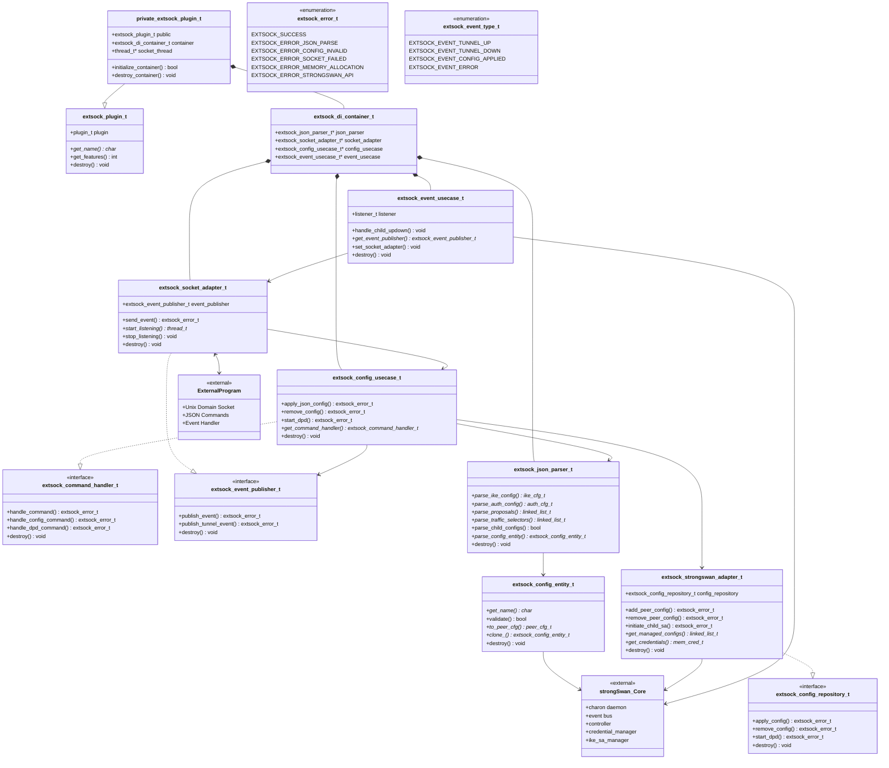

# extsock Plugin Class Diagram

## 전체 아키텍처 구조

## 아키텍처 설명

### 1. 플러그인 코어 (Core Plugin)
- **extsock_plugin_t**: strongSwan 플러그인 인터페이스
- **private_extsock_plugin_t**: 실제 플러그인 구현체
- **extsock_di_container_t**: 의존성 주입 컨테이너

### 2. 도메인 계층 (Domain Layer)
- **extsock_config_entity_t**: IPsec 설정을 나타내는 도메인 엔티티

### 3. 유스케이스 계층 (Use Case Layer)
- **extsock_config_usecase_t**: 설정 관리 비즈니스 로직
- **extsock_event_usecase_t**: 이벤트 처리 비즈니스 로직

### 4. 인터페이스 계층 (Interface Layer)
- **extsock_command_handler_t**: 명령 처리 인터페이스
- **extsock_config_repository_t**: 설정 저장소 인터페이스
- **extsock_event_publisher_t**: 이벤트 발행 인터페이스

### 5. 어댑터 계층 (Adapter Layer)
- **extsock_socket_adapter_t**: 유닉스 도메인 소켓 통신 어댑터
- **extsock_strongswan_adapter_t**: strongSwan API 어댑터
- **extsock_json_parser_t**: JSON 파싱 어댑터

### 6. 외부 시스템 (External Systems)
- **strongSwan_Core**: strongSwan 데몬 코어
- **ExternalProgram**: 외부 프로그램 (DPDK 등)

## 주요 특징

1. **Clean Architecture 패턴**: 도메인 중심의 계층화된 아키텍처
2. **의존성 주입**: DI 컨테이너를 통한 객체 생성 및 의존성 관리
3. **인터페이스 분리 원칙**: 각 기능별로 인터페이스를 분리하여 결합도 감소
4. **어댑터 패턴**: 외부 시스템과의 통신을 어댑터로 격리

## 데이터 흐름

1. 외부 프로그램 → Socket Adapter → Config Use Case → strongSwan Adapter → strongSwan Core
2. strongSwan Core → Event Use Case → Socket Adapter → 외부 프로그램

이 구조를 통해 외부 프로그램이 JSON 명령을 소켓으로 전송하면, 플러그인이 이를 파싱하여 strongSwan에 적용하고, SA 상태 변화를 다시 외부로 이벤트로 전송하는 전체 흐름을 처리합니다. 